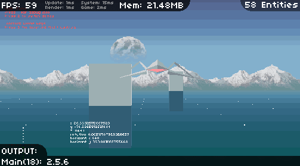

*Notice, 2019: Old project, documentation is incomplete. Uploaded for archival purposes.*  
  


# punk.Pseudo3D
A HaxePunk addon for rendering pseudo 3D objects. 

This can be used to create a lot of different styles and types of games. For example...

* A top-down adventure with a free moving camera
* A sideview diorama-like platformer perhaps like Luigi's Mansion
* A vanishing point racing game in the veins of Outrun

## Pseudo 3D?

I think an animation explains it best.



## More examples

EXAMPLE 1, spritesheet  


EXAMPLE 1, result  


EXAMPLE 2, spritesheet  


EXAMPLE 2, result  


## How to install

~~Basicly just copy over the pseudo3D folder directly into your source directory.
(You can also copy it into your HaxePunk directory if you want to use it in different projects)~~

## How to use

etc

#### IV.


>>>>
Let your imagination run wild!

*spiral gif*

## Ressources and further reading

And finally here are some other great resources on pseudo 3D. Definitely have a poke around some of these!

Guides:
* [Lou's Pseudo 3d Page](http://www.extentofthejam.com/pseudo/) (I just love this!)
* [2d 3d in gamemaker: studio](http://www.like100bears.com/writing/2d-3d-in-gamemaker-studio) (Super simple explanation)
* [Video on the creation of NIUM](https://www.youtube.com/watch?v=iAJ-tyiUVag&t=2445s)

Tools:
* [vox2png](https://github.com/StijnBrouwer/vox2png) (Convert MagicaVoxel files to 2d slice sprite sheet)
* [Pyxel Edit: 3D Viewer](https://chinafreak.itch.io/pyxel-edit-3d-viewer) (Addon for previewing pseudo 3D in Pyxel Edit)
* [SPRIT3D](https://physdick.itch.io/sprit3d) (Tool to create fake 3D sprites)

Games:
* [NIUM by Moppin & Nemk](https://www.youtube.com/watch?v=_BztMPC5Kk4) (Where I got the original idea from)
* [STEP by takorii](https://tak.itch.io/step)
* [lisa by rubna](https://rubna.itch.io/lisa)
* [Grimmsteps by Secret Cat](https://secretcat.itch.io/grimmsteps/devlog/624/the-look-of-grimmsteps) (Check out the devlog)
* [OutRun Longplay](https://www.youtube.com/watch?v=J7tZFW4WedI)

## Acknowledgements

If you have any suggestions, questions or want to help me improve this please let me know!

banach-tarski at posteo.net

I want to thank Louis Gorenfeld for the amazing research they provided. I don't think I could have figured this out without Lou's Pseudo 3d Page.
I also want to give my thanks to Moppin & Nemk for making NIUM, which inspired me to create all of this in the first place.

And thanks a lot to [abetusk](https://mechaelephant.com/) and [sanglorian](https://opengameart.org/users/sanglorian) for their support.  
[Abe's Curated $100 Micro Grant](https://mechaelephant.com/microgrant)

## nonlicense

```
This work is dedicated to the public domain under CC0. https://creativecommons.org/publicdomain/zero/1.0/  
 
That means you are free to use any of my code, art, writing, data, etc. in any way you like.  
An attribution note is appreciated but not necessary. You can credit me as "voec".
If you end up using_remixing this I'd love to hear from you. :)

love ~v

banach-tarski at posteo.net
 
This dedication excludes any work not created by me, which is copyrighted to their respective creators.
I try my best to mark any external contributions and adaptations where possible.
```
